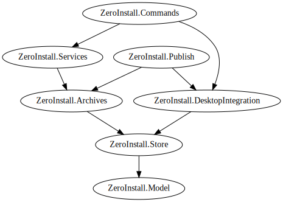

# Zero Install .NET API

Zero Install is a decentralized cross-platform software installation system. You can learn more at [0install.net](https://0install.net/).

This website documents the Zero Install .NET API. You can use this to integrate Zero Install features into your own application.

## NuGet packages

| Package                                                                                          | Namespace                             | Description                                                                                                                                 |
| ------------------------------------------------------------------------------------------------ | ------------------------------------- | ------------------------------------------------------------------------------------------------------------------------------------------- |
| [ZeroInstall.Model](https://www.nuget.org/packages/ZeroInstall.Model/)                           | <xref:ZeroInstall.Model>              | <xref:data-model> for the Zero Install [feed format](https://docs.0install.net/specifications/feed/).                                       |
| [ZeroInstall.Client](https://www.nuget.org/packages/ZeroInstall.Client/)                         | <xref:ZeroInstall.Client>             | <xref:client-library> for invoking Zero Install commands from within other applications.                                                    |
| [ZeroInstall.Store](https://www.nuget.org/packages/ZeroInstall.Store/)                           | <xref:ZeroInstall.Store>              | Management of [implementation caches](https://docs.0install.net/details/cache/), digital signatures, etc..                                  |
| [ZeroInstall.Archives](https://www.nuget.org/packages/ZeroInstall.Archives/)                     | <xref:ZeroInstall.Archives>           | Extracting and building archives (`.zip`, `.tar`, etc.).                                                                                    |
| [ZeroInstall.Services](https://www.nuget.org/packages/ZeroInstall.Services/)                     | <xref:ZeroInstall.Services>           | <xref:services> for solving dependencies, downloading implementations, executing apps, etc..                                                |
| [ZeroInstall.DesktopIntegration](https://www.nuget.org/packages/ZeroInstall.DesktopIntegration/) | <xref:ZeroInstall.DesktopIntegration> | Integrating applications with [desktop environments](https://docs.0install.net/details/desktop-integration/) (creating menu entries, etc.). |
| [ZeroInstall.Commands](https://www.nuget.org/packages/ZeroInstall.Commands/)                     | <xref:ZeroInstall.Commands>           | <xref:command-line-interface> for Zero Install. The binary in this package serves both as an actual CLI and a library for building other clients.  |
| [ZeroInstall.Publish](https://www.nuget.org/packages/ZeroInstall.Publish/)                       | <xref:ZeroInstall.Publish>            | Utilities for [creating and modifying feed files](xref:publishing).                                                                         |

### Dependencies

